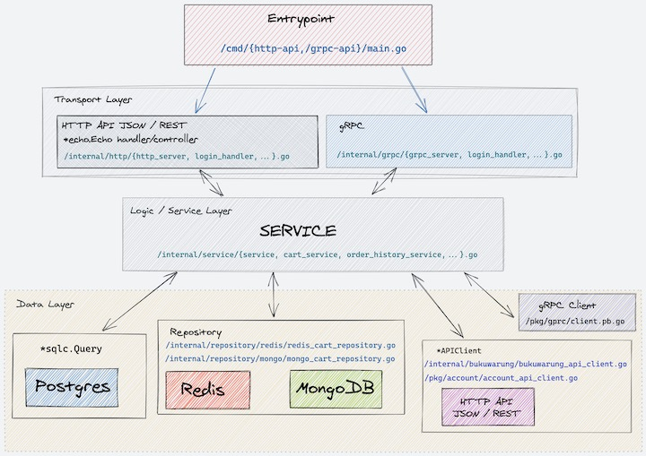

# GoLang Service Design

## Service Design

You can refer to the following image.

## Data Flow

1. User request goes to REST endpoint
2. Validate user input at handler/controller level. Validation does not cover
   checking external system (db, redis, http). Pure just checking
   based on the payload request.
3. Build request for service object (if necessary), then call service function.
4. Based on the response from the service object, the handler/controller determines:
    * If successful, build & return ok response / payload to user.
    * If it fails, the error returns immediately. For details on error handling, 
   see the document [echo_http_error_handling](./2_echo_api_design.md) &
        [grpc_error_handling](./3_grpc_api_design.md)

## Service method naming guide

Use only [Create, Get, Put, Delete, Update, List] prefix.
e.x. :

* `Create` to create a new resource (whether writing to storage or not)
    * example: `CreateUser(ctx context.Context, ID string) (User, error)`
* `Get` to get _*single*_ resource which pre-existing in
  datasource
    * example: `GetUser(ctx context.Context, ID string) (User, error)`
* `Update` to update a pre-existing *single* resource directly
  overall (replace existing resource)
    * example: `UpdateUser(ctx context.Context, u *User)eerror`
* `Put` to partially update *single* resource.
* `List` to get *many* resources that already exist in
  datasource
    * `ListUser(ctx context.Context, options FilterOptions) ([]User, error)`
* `Delete` to delete *single* resource in datasource
    * `DeleteUser(ctx context.Context, ID string) error`

2. Use `context.Context` as the first parameter for functions that interact with external systems.
   Document reference [using context parameter](./1_4_context_parameter.md)
    * External call to redis? use `context.Context`
    * query to postgres / mongodb ? use `context.Context`

## Reference

* [CRUD-y By Design](https://github.com/adamwathan/laracon2017)
