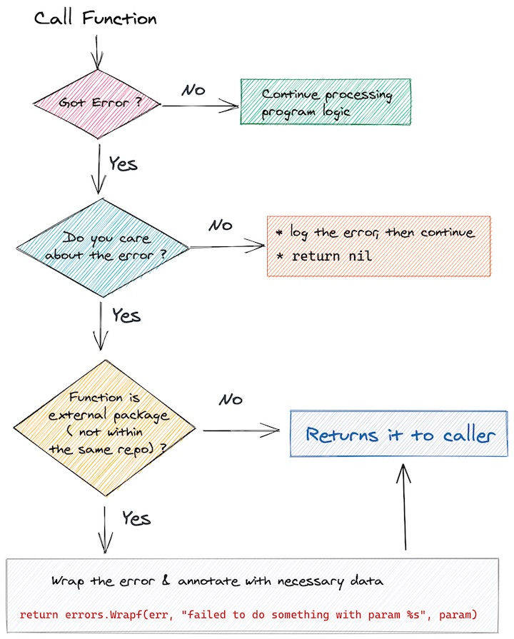

# Error Handling

## Background

There are studies that analyze bugs in the open source projects Cassandra, HBase, HDFS, MapReduce, and Redis.
The result is as follows.

* 92% : Failures from bad error handling
  * __35% : Incorrect handling__
    * 25% : Simply ignoring an error
    * 8% : Catching the wrong exception
    * 2% : Incomplete TODOs
  * 57% System specific
    * 23% : Easily detectable
    * 34% : Complex bugs
* 8% : Failures from latent human errors

In programming, errors can and will happen. Most of the bugs that
occurs in the program due to poor `error handling`.

The most intuitive thing that is often done is to log every error found.

```go
    if err != nil {
        log.Printf("got error here %s \n", err.Error())
        return err
    }
```

The above may be effective in development, but not efficient when run in production. For 1 endpoint hit from a user, it can produce 2-5 log lines or more. Not added with log2 apart from the error check block. Multiply by the number of active endpoints that the user can hit. Multiply by the number of visitors per second.

Problems:

1. Use more extravagant storage
2. Trace/debug is not *straight to the point*, like talking to a stutterer.

Here's what to do when we encounter an error.

## What to do



*Rule of 2* when getting error value `(function call, constructor, dll)`:

1. Handle the error. It can be a log, `abort program`, or

```go
    err := functionWithPossibleError()
    if err != nil {
        log.Error(err, "got error from functionWithPossibleError. continue...")
    }

    // if error is not fatal, continue processing program...
```

2. `Return error` -> `function caller`.
    * If the error comes from an external package dependency (either import or generated sqlc/protobuff), annotate the error.
    * If we have previously defined errors as `var` error variables, use `errors.Withstack()` if not necessary
      additional info. If you need additional info, use `errors.Wrap()`.

```go
    // myFunctionCall is still in the same git repo source code/project & not generated
    err := myFunctionCall(ctx)
    if err != nil {
        return err
    }


    // db.Query comes from package 'sql/db'
    // annotate the error generated before it is returned to the function caller
    // using the message format: "<package>: <error_msg>"
    // e.g. "http_client: failed to call http url", "repository: failed to query data"
    func myFunctionCall(ctx context.Context) error {
        err := db.QueryContext(ctx, query, id)
        if err != nil {
            return errors.Wrapf(err, "repository: failed to get data with id %s", id)
        }

        // continue function ....

        return nil
    }


    // If the error is a predefined variable, wrap the error with the parameter info used

    // ErrInvalidOrderID in case when order id doesn't exists
    var ErrInvalidOrderID = errors.New("order tidak valid")

    func updateOrderByID(ctx context.Context, ID string) error {
        order, err := query.GetOrderByID(ctx, ID)
        if err != nil {
            // order id not found
            if errors.Is(sql.ErrNoRows) {
                // need additional info, use errors.Wrap()
                return errors.Wrapf(ErrInvalidOrderID, "order_ID=%s", ID) // <- HERE

                // You don't need additional info, use errors.WithStack()
                return errors.WithStack(ErrInvalidOrderID)
            }

            // db conn timeout, invalid query, etc
            // the query is still in the same repo, but the results are generated from the sqlc package
            // so keep wrapping the error return
            return errors.Wrap(err, "failed to get order_id=%s", ID)
        }
    }
```

If the error has been handled, then the error does not need to be returned to upper
functions / stacks.

## What NOT to do

* Returns error and error log at the same time.

    ```go
    // Don't do this. Choose one 1, return error / log. Because the log is also a form of error handling
    if err := myFunc(ctx); er != nil {
        log.Println("got error ", err.Error())
        return err
    }
    ```

* Return `errors.New()`

    ```go
    // Don't do this. The original value/information of the `err` error will be lost from the stacktrace. Use `errors.Wrap(err, ...)`
    if err := myFunc(ctx); er != nil {
        return errors.New("internal service error")
    }
    ```

* Ignore error di critical path

    ```go
    // Not all errors need to be captured, for example `fmt.Printf`
    // can be written like:
    _, _ = fmt.Printf("something happened \n")
    // or
    fmt.Printf("something happened \n")

    // BUT DO NOT IGNORE error on critical / main logic program
    db, _ := postgres.NewPostgresDatabase(opt)
    pgRepo := repo.NewPGRepo(db)

    // the program will crash when querying with condition db == nil, panic nil pointer exception
    // it would be better to fail/return early when an error is found.
    ```

## Additional Reading

* [Don't just check errors, handle them gracefully](https://dave.cheney.net/2016/04/27/dont-just-check-errors-handle-them-gracefully)
* [Why go error handling is awesome](https://rauljordan.com/2020/07/06/why-go-error-handling-is-awesome.html)
* [35% software bugs comes from incorrect error handling](https://www.usenix.org/system/files/login/articles/login_aug15_08_gunawi.pdf)
