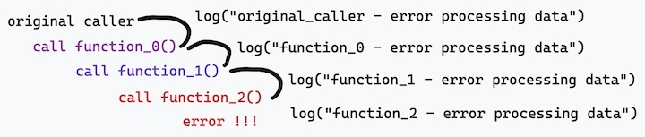
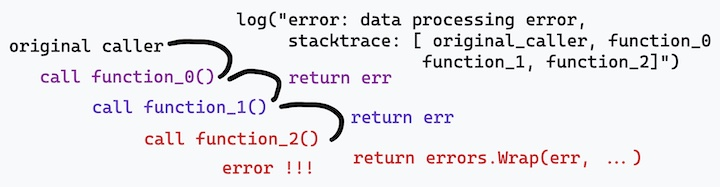

# Logging

## Avoid stuttering logging

Please don't do this



the output of the *pseudocode* above is something like this:

```go
// if every function does error checking like this
if err != nil {
    logs...
    return err
}

// OUTPUT:
// <timestamp> function_2 - error processing data
// <timestamp> function_1 - error processing data
// <timestamp> function_0 - error processing data
// <timestamp> original_caller - error processing data
```

for local development, no problem. But in the server environment /
production, it could be that the log output overlaps with the output of the error case
other.

It is better if error logging is done as follows:



> For logging related to error handling, please refer to the document [error handling](./1_2_error_handling.md)


## Reference

* [Zerolog non-blocking writer](https://github.com/rs/zerolog#thread-safe-lock-free-non-blocking-writer)